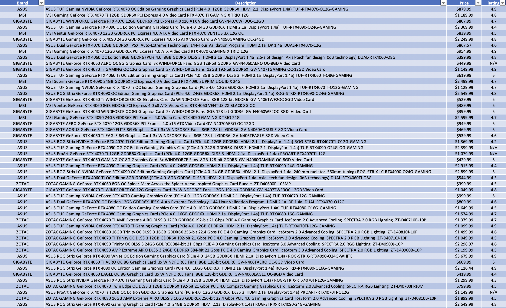

# WebScraper
This is a python script that uses the Beautiful Soup package to parse Newegg to obtain prices for the Nvidia 4000 series graphics cards.

The csv file was exported to excel to better view the data. Some of the table generated can be seen below:

